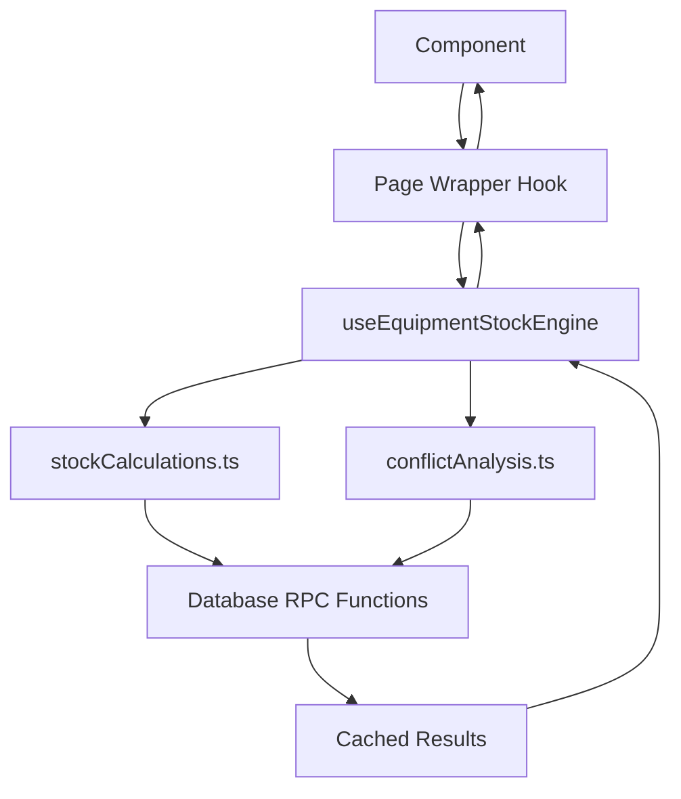

# 🎯 EQUIPMENT ENGINE ARCHITECTURE STRATEGY

## CORE PRINCIPLE: ONE ENGINE TO RULE THEM ALL

**Single source of truth for ALL equipment stock operations across the entire application.**

## ARCHITECTURE OVERVIEW

```typescript
// 🏗️ ONE CONFIGURABLE ENGINE (Core)
useEquipmentStockEngine(config: EquipmentEngineConfig) {
  // Smart calculations based on component needs
  // Returns: stock data, conflicts, suggestions, helper methods
}

// 📄 ONE WRAPPER PER MAIN PAGE (Clean APIs)
useDashboardStock(selectedOwner?: string)     // Dashboard page
useProjectStock(projectId: string)            // Project detail page
useTimelineStock(visibleRange: DateRange)     // Timeline/Planner page
useGlobalSearchStock(query: string)           // Global search results
```

## CONFIGURATION STRATEGY

### Engine Configuration Interface
```typescript
interface EquipmentEngineConfig {
  // REQUIRED: Each component defines its date needs
  dateRange: { start: Date; end: Date };
  
  // OPTIONAL: Scope filtering
  equipmentIds?: string[];        // Default: ALL equipment
  selectedOwner?: string;         // Filter by owner
  folderPaths?: string[];         // Filter by folders
  
  // OPTIONAL: Feature flags
  includeVirtualStock?: boolean;   // Default: true
  includeConflictAnalysis?: boolean; // Default: true
  includeSuggestions?: boolean;    // Default: false
  
  // OPTIONAL: Performance tuning
  cacheResults?: boolean;         // Default: true
  batchSize?: number;            // Default: 100
}
```

## PAGE-SPECIFIC IMPLEMENTATIONS

### 🏠 Dashboard: Fixed 30-Day Window
```typescript
function useDashboardStock(selectedOwner?: string) {
  const { startDate, endDate } = getWarningTimeframe(); // Always 30 days
  
  return useEquipmentStockEngine({
    dateRange: { start: new Date(startDate), end: new Date(endDate) },
    selectedOwner,
    includeConflictAnalysis: true,
    includeSuggestions: false,      // Dashboard doesn't need suggestions
    cacheResults: true,             // Heavy caching for overview
    batchSize: 200                  // Large batches for overview
  });
}
```

**Use Cases:**
- Dashboard stats cards
- Equipment conflict alerts
- Operational status overview

### 📋 Project: Project-Specific Dates
```typescript
function useProjectStock(projectId: string) {
  const projectDates = getProjectDateRange(projectId); // Only project span
  
  return useEquipmentStockEngine({
    dateRange: projectDates,        // Efficient: only project timespan
    includeConflictAnalysis: true,
    includeSuggestions: true,       // Projects need subrental suggestions
    cacheResults: true,             // Moderate caching
    batchSize: 100                  // Balanced batching
  });
}
```

**Use Cases:**
- Project detail equipment conflicts
- Event operational status
- Project-specific subrental suggestions

### 📅 Timeline: Dynamic Custom Ranges
```typescript
function useTimelineStock(visibleRange: DateRange) {
  return useEquipmentStockEngine({
    dateRange: visibleRange,        // User-controlled scrolling range
    includeConflictAnalysis: true,
    includeSuggestions: true,       // Timeline shows suggestions
    cacheResults: false,            // Less caching (range changes frequently)
    batchSize: 50                   // Small batches for responsiveness
  });
}
```

**Use Cases:**
- Timeline conflict detection
- Real-time availability calculations
- Infinite scroll performance

### 🔍 Global Search: Query-Driven
```typescript
function useGlobalSearchStock(query: string) {
  const { startDate, endDate } = getWarningTimeframe(); // 30-day context
  
  return useEquipmentStockEngine({
    dateRange: { start: new Date(startDate), end: new Date(endDate) },
    includeConflictAnalysis: true,
    includeSuggestions: false,      // Search doesn't need suggestions
    cacheResults: true,             // Cache search results
    batchSize: 20                   // Small batches for quick results
  });
}
```

**Use Cases:**
- Equipment search with conflict warnings
- Availability-aware search results

## IMPLEMENTATION RULES

### ✅ DO
1. **Use page-level wrapper hooks** - Clean component APIs
2. **Configure engine per page needs** - Efficient calculations
3. **Cache appropriately** - Dashboard heavy, Timeline light
4. **Batch size optimization** - Large for overview, small for responsiveness
5. **Date range precision** - Only calculate needed timeframes

### ❌ DON'T
1. **Create multiple engines** - ONE ENGINE only
2. **Manual conflict calculations** - Use engine methods
3. **Intermediate transformation layers** - Direct engine consumption
4. **Global caching for dynamic data** - Smart caching per use case
5. **Fixed date ranges everywhere** - Component-specific ranges

## DATA FLOW



## MIGRATION CHECKLIST

- [ ] ✅ Dashboard components → `useDashboardStock`
- [ ] ✅ Event hooks → `useProjectStock`
- [ ] 🔄 Timeline hub → `useTimelineStock`
- [ ] 🔄 Global search → `useGlobalSearchStock`
- [ ] 🔄 Project detail components → `useProjectStock`
- [ ] ❌ Delete ALL old hooks: `useStockEngine`, `useDashboardConflicts`, etc.
- [ ] ❌ Remove ALL manual equipment calculations
- [ ] ❌ Eliminate duplicate conflict detection logic

## PERFORMANCE EXPECTATIONS

### Before (Fragmented)
- Dashboard: 3-5 second load, multiple DB calls
- Timeline: 2-3 second scroll lag, recalculation on every change
- Project: 1-2 second conflict detection, duplicate calculations

### After (ONE ENGINE)
- Dashboard: <1 second load, single optimized calculation
- Timeline: <500ms scroll response, cached calculations
- Project: <300ms conflict detection, shared cache benefits

## FUTURE EXTENSIBILITY

This architecture easily supports:
- **New pages**: Add wrapper hook with specific config
- **New features**: Extend engine config interface
- **Performance tuning**: Adjust cache and batch strategies per page
- **Scale**: Engine handles 10K+ equipment efficiently

## SUCCESS METRICS

1. **Consistency**: All equipment data comes from ONE source
2. **Performance**: Page-specific optimizations
3. **Maintainability**: Clean APIs, no duplicate logic
4. **Extensibility**: Easy to add new equipment-using features
